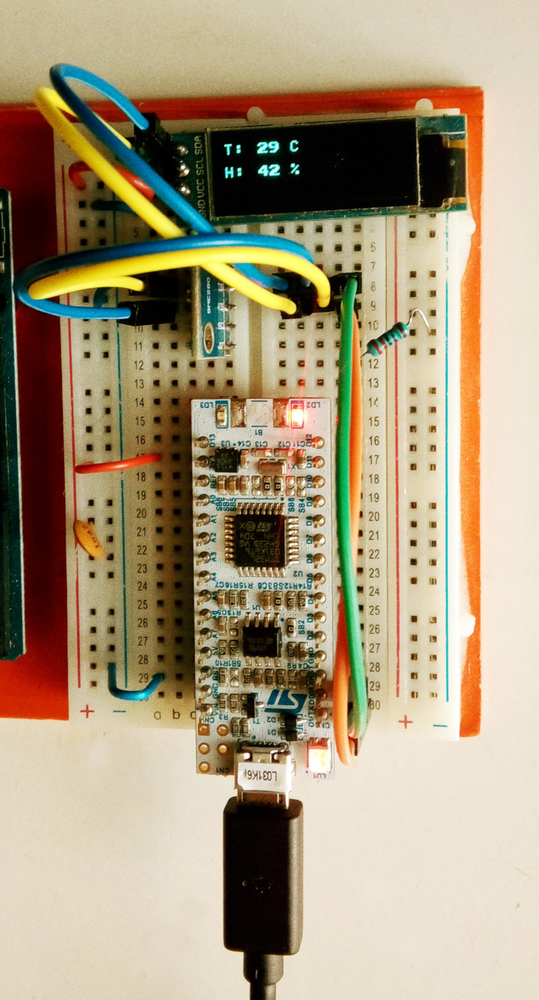

## Weather station

Simple weather station using STM32L031K6T6 Nucleo32 board,
Bosch BME280 sensor and SSD1306 OLED display.

Uses the shared-bus crate to share the I2C bus between the sensor and the display.

TO DO:
* Refresh only every n seconds (delay provided with cortex_m::asm::delay doesn't seem to work correctly, and BME280 driver consumes the delay instance)
* Ideally use RTIC, otherwise timers and mutexes.

Known issues: 
* will not work with MSI Range4 and below 
* needs MSI Range6 or higher frequency for 400kHz I2C frequency 